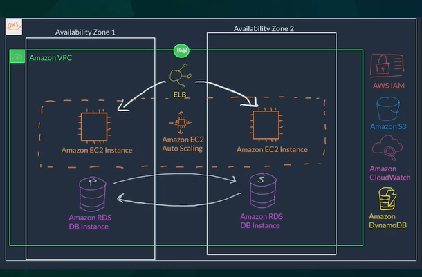

- cloud computing and the benefits of the cloud
- AWS global infrastructure
- security and identity and access management

- **Employee Directory application.**
    - This application will be built in a private network using **Amazon Virtual Private Cloud or VPC**
    - We will host the application's backend code on Amazon **Elastic Compute Cloud or EC2**, which is a service that essentially offers virtual machines on AWS.
    - The employee data will be stored in a database which will also live inside of this network. And this will be hosted using a service called Amazon **Relational Database Service or RDS**, or we might be hosting it on **Amazon DynamoDB**
    - The images for the employees will be stored using the object storage service Amazon **Simple Storage Service**, S3, which will allow the unlimited storage of _any file type_ like the images in this example.
    - **Amazon CloudWatch** for monitoring the solution
    - to ensure that our application is scalable and fault-tolerant. we are going to add an **Elastic Load Balancer**, ELB here which will distribute the traffic across the EC2 instances. 
    - And we will also add **Amazon EC2 Auto Scaling**, so that way our solution can scale out with demand and scale in when demand decreases.
    - For security and identity, we will be using Amazon **Identity and Access Management or IAM**.

    

**What is cloud computing?**
- Cloud computing is the on-demand delivery of IT resources over the internet with pay-as-you-go pricing.
- You no longer have to manage and maintain your own hardware in your own data centers. Companies like AWS own and maintain these data centers and provide virtualized data center technologies and services to users over the internet.

**Six Benefits of Cloud Computing**
1. Pay as you go.
2. Benefit from massive economies of scale: By using cloud computing, you can achieve a lower cost than you can get on your own. Because usage from hundreds of thousands of customers is aggregated in the cloud, AWS can achieve higher economies of scale, which translates into lower pay as-you-go prices.
3. Stop guessing infrastructure capacity.
4. Increase speed and agility: IT resources are only a click away, which means that you reduce the time to make those resources available to your developers from weeks to just minutes.
5. Stop spending money running and maintaining data centers.
6. Go global in minutes: Easily deploy your application in multiple Regions around the world with just a few clicks. This means you can provide lower latency and a better experience for your customers at a minimal cost.

**Types of cloud computing**
- **Infrastructure as a Service**
    - IaaS contains the basic building blocks for cloud IT. 
    - It typically provides access to **networking features, computers (virtual or on dedicated hardware), and data storage space**. 
    - IaaS gives you the highest level of flexibility and management control over your IT resources. 
- **Platform as a Service**
    - PaaS removes the need for you to manage underlying infrastructure (usually hardware and operating systems), and **allows you to focus on the deployment and management of your applications.** 
    - This helps you be more efficient as you don’t need to worry about resource procurement, capacity planning, software maintenance, patching, or any of the other undifferentiated heavy lifting involved in running your application. 
- **Software as a Service**
    - SaaS provides you with a complete product that is run and managed by the service provider. 
    - In most cases, people referring to SaaS are referring to **end-user applications** (such as web-based email). 
    - With a SaaS offering, you don’t have to think about how the service is maintained or how the underlying infrastructure is managed. You only need to think about how you will use that particular software. 

**Cloud Computing Deployment Models**
- **Cloud**
    - A cloud-based application is fully deployed in the cloud and all parts of the application run in the cloud.
- **Hybrid**
    - way to connect infrastructure and applications between cloud-based resources and existing resources that are not located in the cloud. 
    - The most common method of hybrid deployment is between the cloud and existing on-premises infrastructure to extend, and grow, an organization's infrastructure into the cloud
- **On-premises**
    - The deployment of resources on-premises, using virtualization and resource management tools, is sometimes called the “private cloud.” 

Useful Links:
- https://aws.amazon.com/what-is-cloud-computing/
- https://docs.aws.amazon.com/whitepapers/latest/aws-overview/types-of-cloud-computing.html
- https://aws.amazon.com/what-is-aws/

