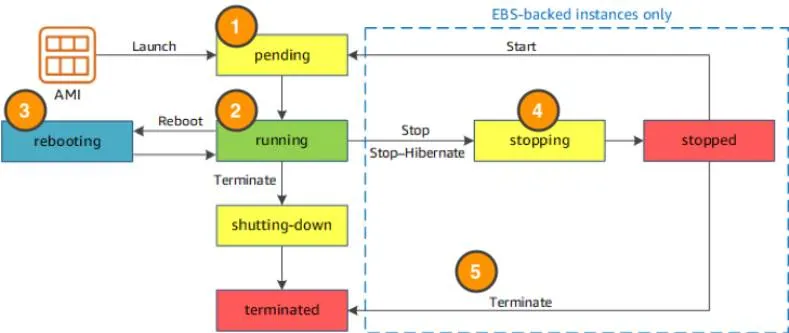

## Amazon EC2 Instance Lifecycle

**Where Does Your EC2 Instance Live?**
- By default, your EC2 instances are placed in a network called the **default** Amazon **Virtual Private Cloud (VPC)**. 
- Any resource you put inside the default VPC will be public and accessible by the internet, so you shouldn’t place any customer data or private information inside of it.
- Once you get more comfortable with networking on AWS, you should change this default setting to choose your own custom VPCs and restrict access with additional routing and connectivity mechanisms.

**Architect for High Availability**
- Inside this network, your instance resides in an Availability Zone of your choice. AWS services that are scoped at the Availability Zone level must be architected with **high availability** in mind.
- While EC2 instances are typically **reliable**, two is better than one, and three is better than two. Specifying the instance size gives you an advantage when designing your architecture because you can **use more smaller instances instead of a few larger ones.**
- If your frontend only has a single instance and that instance fails, your application goes down. On the other hand, if your workload is distributed across 10 instances and one fails, you lose only 10 percent of your fleet and your application availability is hardly affected.
- When architecting any application for high availability, **consider using at least two EC2 instances in two separate Availability Zones.** ­­

**Explore the EC2 Instance Lifecycle**
- An EC2 instance transitions between different states from the moment you create it all the way through to its termination.

    

- When you launch an instance, it enters the **pending state** (1). 
    - When the instance is pending, billing has not started. 
    - At this stage, the instance is preparing to enter the running state. Pending is where AWS performs all actions needed to set up an instance, such as **copying the AMI content to the root device** and **allocating the necessary networking components.**

- When your instance is **running** (2), it's ready to use. 
    - the stage where billing begins. 
    - As soon as an instance is running, you are then able to take other actions on the instance, such as reboot, terminate, stop, and stop-hibernate.

- When you **reboot** an instance (3), 
    - it’s different than performing a stop action and then a start action. 
    - Rebooting an instance is equivalent to rebooting an operating system. The **instance remains on the same host computer and maintains its public and private IP address, and any data on its instance store.**
    - It typically takes a few minutes for the reboot to complete. 
- When you **stop and start an instance** (4), 
    - your instance may be placed on a new underlying physical server. 
    - Therefore, you lose any data on the instance store that were on the previous host computer. 
    - When you stop an instance, the **instance gets a new public IP address but maintains the same private IP address.**
- When you **terminate an instance** (5), 
    - the instance store are erased 
    - you lose both the public IP address and private IP address of the machine. 
    - Termination of an instance means you can no longer access the machine.
- **What Is the Difference Between Stop and Stop-Hibernate?**
    - When you stop your instance, it enters the stopping state, and then the stopped state. AWS does not charge usage or data transfer fees for your instance after you stop it, but storage for any Amazon EBS volumes is still charged. While your instance is in the stopped state, you can modify some attributes, like the instance type. When you stop your instance, the data stored in memory (RAM) is lost.

    - When you stop-hibernate your instance, AWS signals the operating system to perform hibernation (suspend-to-disk), which saves the contents from the instance memory (RAM) to the Amazon EBS root volume.

    - Consider a scenario where you build a standard three tier application, where you have web servers, application servers and database servers. Turns out, the application you built  becomes extremely popular. To relieve some stress on the database that supports your application, you want to implement a custom backend layer that caches database information in memory (RAM). You decide to run this custom backend caching solution on Amazon EC2.
    - In this scenario, the stop-hibernate feature would be instrumental in persisting storage. It would prevent you from having to manually create scripts to save this RAM data before shutting down the server.

**What Makes Up the Pricing?**
- To understand EC2 pricing, let’s decouple the instance price from other services attached to it, such as storage and networking costs. In this unit we refer to the instance cost as the cost associated with the instance in terms of specifications and not the total blended cost of running an instance.
- Once an instance is launched in your AWS account, the billing usually accrues on a per-second basis. For simplicity of calculation, prices are stated per-hour. For example, if you have an instance running for 5 minutes and 38 seconds during a given month, you only pay for 338 seconds of utilization at the end of the month.
- One exception to this pricing convention may be third-party AMIs purchased from the AWS Marketplace, which may have a minimum billing of 1 hour. 

**What Are the EC2 Pricing Options?**
- One of the ways to reduce costs with Amazon EC2 is to choose the right pricing option for the way your applications run. 
- There are three main purchasing options for EC2 instances: **on-demand**, **reserved**, and **spot instances**. 
1. **Pay As You Go with On-Demand Instances**
    - With On-Demand instances, you pay for compute capacity with no long-term commitments. 
    - Billing begins whenever the instance is running, and billing stops when the instance is in a stopped or terminated state. 
    - The price per second for a running On-Demand instance is fixed.
    - For applications that require servers to be running all the time, you are less likely to benefit from the On-Demand pricing model, simply because there is no situation where you will need to turn servers off. For example, you might want the web server hosting the frontend of your corporate directory application to be running 24/7 so that users can access the website at any time. Even if there are no users connected to your website, you don’t want to shut down the servers supporting the site in case of potential user activity.In the case when servers cannot be stopped, consider using a Reserved Instance to save on costs.

2. **Reserve Capacity with Reserved Instances (RIs)**
    - RIs provide you with a significant discount compared to On-Demand instance pricing. 
    - RIs provide a discounted hourly rate and an optional capacity reservation for EC2 instances. 
    - You can choose between three payment options: 
        - All Upfront, 
        - Partial Upfront, or 
        - No Upfront. 
    - You can select either a 1-year or 3-year term for each of these options. Depending on which option you choose, you are discounted differently.
    - All Upfront offers a higher discount than Partial Upfront instances.Partial Upfront instances offer a higher discount than No Upfront.No Upfront offers a higher discount than On-Demand.

    - **On-Demand and No Upfront are similar since both do not require any upfront payment. However, there is a major difference. When you choose an On-Demand instance, you stop paying for the instance when you stop or terminate the instance. When you stop an RI, you still pay for it because you committed to a 1-year or 3-year term.**

    - Reserved Instances are associated with an instance type and an Availability Zone depending on how you reserve it. The discount applied by a Reserved Instance purchase is not directly associated with a specific instance ID, but with an instance type.

3. **Save on Costs with Spot Instances**
    - Amazon EC2 Spot Instances allow you to take advantage of unused EC2 capacity in the AWS Cloud. 
    - They are available at up to a 90% discount compared to On-Demand prices.
    - With Spot Instances, you set a limit on how much you would like to pay for the instance hour. This is compared against the current Spot price that AWS determines. If the amount you pay is more than the current Spot price and there is capacity, then you will receive an instance. While they are very promising from the billing perspective, there are some architectural considerations you will need to consider in order to use them effectively.

    - One consideration is that your **spot instance may be interrupted.** For example, if AWS determines that capacity is no longer available for a particular spot instance or if the Spot price exceeds how much you are willing to pay, AWS will give you a 2-minute warning before it interrupts your instance. That means any application or workload that runs on a Spot instance must be able to be interrupted.
    - Because of this unique consideration, **inherently fault-tolerant workloads are typically good candidates to use with Spot instances.** These include big data, containerized workloads, continuous integration/continuous delivery (CI/CD), web servers, high-performance computing (HPC), image and media rendering, or other test and development workloads.

**Resources**
- Amazon EC2: https://aws.amazon.com/ec2/?ec2-whats-new.sort-by=item.additionalFields.postDateTime&ec2-whats-new.sort-order=desc
- Default VPC and default subnets: https://docs.aws.amazon.com/vpc/latest/userguide/default-vpc.html
- AWS Reliability Pillar (PDF): https://d1.awsstatic.com/whitepapers/architecture/AWS-Reliability-Pillar.pdf
- Instance lifecycle: https://docs.aws.amazon.com/AWSEC2/latest/UserGuide/ec2-instance-lifecycle.html
- Amazon EC2 pricing: https://aws.amazon.com/ec2/pricing/
- Amazon EC2 On-Demand Pricing: https://aws.amazon.com/ec2/pricing/on-demand/
- Amazon EC2 Spot Instances Pricing: https://aws.amazon.com/ec2/spot/pricing/
- Amazon EC2 Reserved Instances Pricing: https://aws.amazon.com/ec2/pricing/reserved-instances/pricing/
