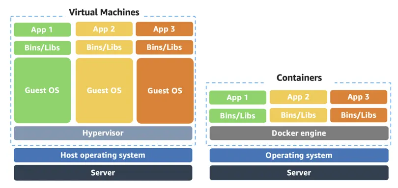
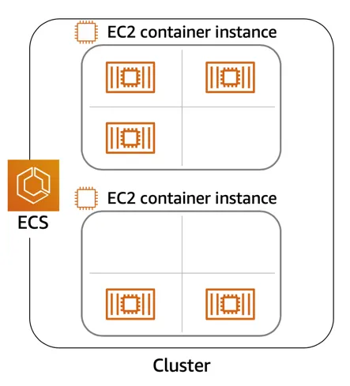
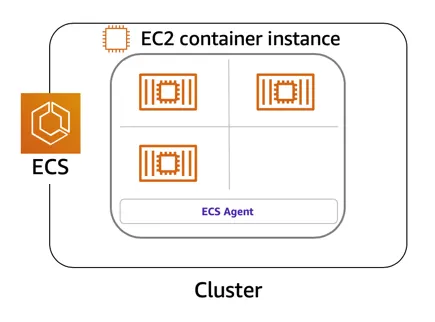

## Container Services on AWS
- The three main categories of compute are **virtual machines, containers, and serverless.** There is no one-size-fits-all service because it depends on your needs.
- Containers can host a variety of different workloads, including web applications, lift and shift migrations, distributed applications, and streamlining of development, test, and production environments.

**What Is a Container?**
- While containers are often referred to as a new technology, the idea started in the 1970s with certain Linux kernels having the ability to separate their processes through isolation. At the time, this was configured manually, making operations complex.
- With the evolution of the open source software community, containers evolved. Today, containers are used as a solution to problems of traditional compute, including the issue of getting software to run reliably when it moves from one compute environment to another.
- **A container is a standardized unit that packages up your code and all of its dependencies.** This package is designed to **run reliably on any platform**, because the container **creates its own independent environment**. 
- This makes it easy to carry workloads from one place to another, such as from development to production or from on-premises to the cloud - **portability.**


**What Is Docker?**
- When you hear the word container, you may associate it with Docker. Docker is a popular **container runtime** that simplifies the management of the entire operating system stack needed for container isolation, including networking and storage. 
- Docker is an open source containerization platform, which makes it easy to create, package, deploy, and run containers.

**What Is the Difference Between Containers and VMs?**
    

- **operating system** :
    - Containers share the same operating system and kernel as the host they exist on, 
    - whereas virtual machines contain their operating system. Since each virtual machine has to maintain a copy of an operating system, there’s a degree of wasted space.
- A **container is more lightweight.** They spin up quicker, almost instantly. This difference in **startup time** becomes instrumental when designing applications that need to scale quickly during input/output (I/O) bursts.
- While containers can provide speed, **virtual machines offer you the full strength of an operating system** and offer more resources, like package installation, a dedicated kernel, and more.

**Orchestrate Containers**
- In AWS, containers run on EC2 instances. For example, you may have a large instance and run a few containers on that instance.
- While running one instance is easy to manage, it lacks high availability and scalability. Most companies and organizations run many containers on many EC2 instances across several Availability Zones.
- If you’re trying to manage your compute at a large scale, you need to know:
    - How to place your containers on your instances.
    - What happens if your container fails.
    - What happens if your instance fails.
    - How to monitor deployments of your containers.
- This coordination is handled by a container orchestration service. AWS offers two container orchestration services: 
    1. Amazon **Elastic Container Service (ECS)** and 
    2. Amazon **Elastic Kubernetes Service** (EKS).


**Manage Containers with Amazon Elastic Container Service (Amazon ECS)**
- Amazon ECS is an **end-to-end container orchestration service** that allows you 
    - **to quickly spin up new containers** and 
    - **manage them across a cluster of EC2 instances.**
    
- To run and manage your containers, you need to install the **Amazon ECS Container Agent** on your EC2 instances.      
    - This agent is open source and responsible for communicating back to the Amazon ECS service about cluster management details.
    - You can run this agent on both Linux and Windows AMIs. 
    - **An instance with the container agent installed is often called a container instance.**
    
- Once the Amazon ECS container instances are up and running, you can perform actions that include, but are not limited to, 
    - launching and stopping containers, 
    - getting cluster state, 
    - scaling in and out, 
    - scheduling the placement of containers across your cluster, 
    - assigning permissions, and 
    - meeting availability requirements.
- To prepare your application to run on Amazon ECS, you create a **task definition**. 
    - The task definition is **a text file, in JSON format**, **that describes one or more containers**. 
    - A task definition is similar to a blueprint that describes the resources you need to run that container, such as CPU, memory, ports, images, storage, and networking information.
    - Here is a simple task definition that you can use for your corporate director application. In this example, the runs on the Nginx web server.
    ```
        {
            "family": "webserver",
            "containerDefinitions": [ {
                "name": "web",
                "image": "nginx",
                "memory": "100",
                "cpu": "99"
            } ],
            "requiresCompatibilities": [ "FARGATE" ],
            "networkMode": "awsvpc",
            "memory": "512",
            "cpu": "256"
        }
    ```

**Use Kubernetes with Amazon Elastic Kubernetes Service (Amazon EKS)**
- **Kubernetes is a portable, extensible, open source platform for managing containerized workloads and services**. By bringing software development and operations together by design, Kubernetes created a rapidly growing ecosystem that is very popular and well established in the market. 
- If you already use Kubernetes, you can use Amazon EKS to orchestrate these workloads in the AWS Cloud.
- Amazon EKS is conceptually similar to Amazon ECS, but there are some differences.
    - An EC2 instance with the ECS Agent installed and configured is called a container instance. In Amazon EKS, it is called a **worker node.**
    - An ECS Container is called a task. In the Amazon EKS ecosystem, it is called a **pod**.
    - While Amazon ECS **runs on** AWS native technology, Amazon EKS runs on top of Kubernetes.
- If you have containers running on Kubernetes and want an advanced orchestration solution that can provide 
    - simplicity, 
    - high availability, and 
    - fine-grained control over your infrastructure, 
Amazon EKS is the tool for you.

**Containers on AWS**
- Container management tools can be broken down into three categories: **registry** (services that give you a secure place to store and manage your container images), **orchestration** (manages when and where your containers run), and **compute.**(to power your containers)
- Registry
    - **Amazon Elastic Container Registry (ECR)** *is a fully-managed container registry that makes it simpler and faster for developers to store, manage, and deploy container images.*
- Orchestration
    - **Amazon Elastic Container Service**
    - **Amazon Elastic Kubernetes Service**
- Compute
    - **AWS Fargate** *is a serverless compute engine for containers. Fargate makes it easy for you to focus on building your applications.*
    - **Amazon EC2** *Run containers on virtual machine infrastructure with full control over configuration and scaling.*
    - **AWS App Runner** *is a fully managed service that makes it easy for developers to quickly deploy containerized web applications and APIs, at scale and with no prior infrastructure experience required.*

- Tools
    - AWS App2Container
    - AWS Copilot


Other Links:
- https://aws.amazon.com/containers/services/
- https://www.docker.com/resources/what-container
- https://aws.amazon.com/ecs/?whats-new-cards.sort-by=item.additionalFields.postDateTime&whats-new-cards.sort-order=desc&ecs-blogs.sort-by=item.additionalFields.createdDate&ecs-blogs.sort-order=desc
- https://github.com/aws/amazon-ecs-agent
- https://docs.aws.amazon.com/AmazonECS/latest/developerguide/ECS_instances.html
- https://www.coursera.org/learn/containerized-apps-on-aws

