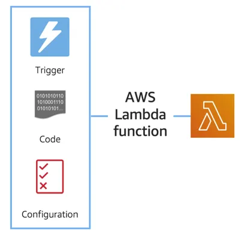

## Introduction to AWS Lambda

- AWS Lambda allows you **to package and upload your code to the Lambda service**, creating what's called a **Lambda function.** 
- Once you create a Lambda function, it isn't always running all of the time. Instead, Lambda functions run in response to triggers.common examples of triggers for Lambda functions are an HTTP request, an upload of a file to the storage service, Amazon S3, events originating from other AWS services or even in-app activity from mobile devices. 
- When the trigger is detected, the code is automatically run in a managed environment, an environment which is automatically scalable, highly available and all of the maintenance of the environment itself is done by AWS. 
- You do get to choose the language your Lambda function is coded in, the amount of memory and CPU your function is allocated in the environment, it's permissions, dependencies and many other aspects of how the function runs. 
- If you have one or 1000 incoming triggers, AWS Lambda will scale your function to meet demand, each in its own isolated environment. 
- Lambda is currently **designed to run code that has a runtime of under 15 minutes**. So, this isn't for long running processes like deep learning or batch jobs, you wouldn't host something like a WordPress site on AWS Lambda. It's more suited for quick processing, like a web backend for handling requests or a backend report processing service. 
- One of the best things about Lambda, is that **you aren't billed for code that isn't running, you only get billed for the resources that you use,** down to 100 millisecond intervals. 


**Run Your Code on AWS Lambda**
- If you want to deploy your workloads and applications without having to manage any EC2 instances or containers, you can use AWS Lambda.
- AWS Lambda lets you run code without provisioning or managing servers or containers. You can run code for virtually any type of application or backend service, including data processing, real-time stream processing, machine learning, WebSockets, IoT backends, mobile backends, and web apps, like your corporate directory app!
- AWS Lambda **requires zero administration from the user**. You upload your source code and Lambda takes care of everything required to run and scale your code with high availability. 

**How Lambda Works**
- There are three primary components of a Lambda function: the **trigger, code, and configuration.**

    


- The code is source code, that describes what the Lambda function should run. This code can be authored in three ways:
    - You create the code from scratch.
    - You use a blueprint that AWS provides.
    - You use same code from the AWS Serverless Application Repository, a resource that contains sample applications, such as “hello world” code, Amazon Alexa Skill sample code, image resizing code, video encoding, and more.
- When you create your Lambda function, you **specify the runtime** you want your code to run in. There are built-in runtimes such as Python, Node.js, Ruby, Go, Java, .NET Core, or you can implement your Lambda functions to run on a custom runtime.
- The configuration of a Lambda function consists of **information that describes how the function should run.** In the configuration, you specify network placement, environment variables, memory, invocation type, permission sets, and other configurations.
- Triggers describe **when the Lambda function should run**. A trigger integrates your Lambda function with other AWS services, enabling you to run your Lambda function in response to certain API calls that occur in your AWS account. This makes you quicker to respond to events in your console without having to perform manual actions.
- All you need is the **what, how, and when** of a Lambda function to have functional compute capacity that runs only when you need it to.
- Amazon’s CTO, Werner Vogels, says, **“No server is easier to manage than no server.”** This quote summarizes the convenience you can have when running serverless solutions, like AWS Fargate and AWS Lambda. 

**AWS Lambda function handler**
- The AWS Lambda function handler is **the method in your function code that processes events.** 
- When your function is invoked, Lambda runs the handler method. When the handler exits or returns a response, it becomes available to handle another event.
- You can use the following general syntax when creating a function handler in Python:
```
    def handler_name(event, context): 
        ...
        return some_value
```
- **Naming:**
    - The Lambda function handler name specified at the time you create a Lambda function is derived from the following:
        - the name of the file in which the Lambda handler function is located
        - the name of the Python handler function
    - A function handler can be any name; however, the default on the Lambda console is `lambda_function.lambda_handler`. This name reflects the function name as lambda_handler, and the file where the handler code is stored in lambda_function.py.
    - If you choose a different name for your function handler on the Lambda console, you must update the name on the **Runtime settings** pane. 

**Billing Granularity**
- AWS Lambda lets you run code without provisioning or managing servers, and you pay only for what you use. You are charged for the number of times your code is triggered (requests) and for the time your code executes, rounded up to the nearest 1ms (duration).
- AWS rounds up duration to the nearest millisecond with no minimum execution time.
- With this pricing, it can be very cost effective to run functions whose execution time is very low, such as functions with durations under 100ms or low latency APIs.

Other Links:
- https://aws.amazon.com/serverless/#:~:text=Serverless%20is%20the%20native%20architecture,services%20without%20thinking%20about%20servers.
- https://www.coursera.org/learn/building-modern-python-applications-on-aws
- https://aws.amazon.com/serverless/getting-started/?serverless.sort-by=item.additionalFields.createdDate&serverless.sort-order=desc
- https://aws.amazon.com/lambda/serverless-architectures-learn-more/
- https://aws.amazon.com/blogs/compute/best-practices-for-organizing-larger-serverless-applications/
- https://docs.aws.amazon.com/lambda/latest/dg/lambda-functions.html
- https://aws.amazon.com/blogs/architecture/ten-things-serverless-architects-should-know/
- https://alienattack.workshop.aws/en/
