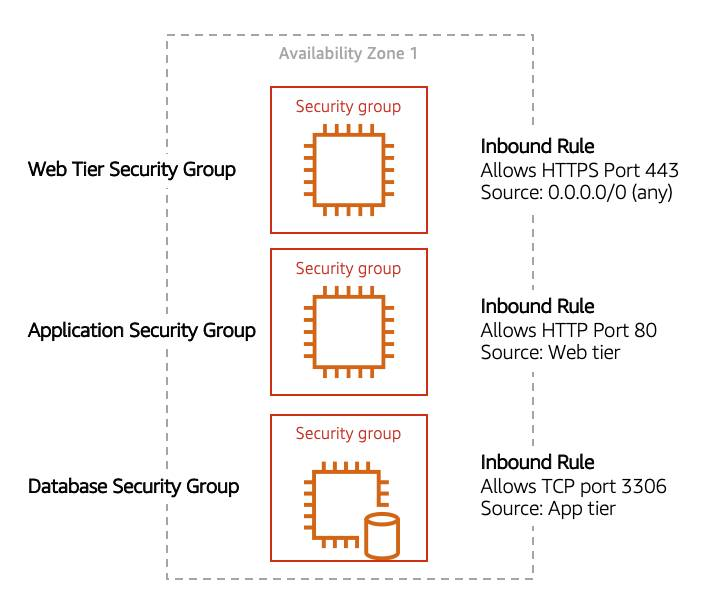

- we have a user that wants to access our employee directory. Eventually internet traffic would flow through the internet gateway, but then where would it go?
    - Just because the traffic entered through the door of the VPC, it doesn't mean it ever made it to the right room. 
    - What we need to do is provide a path for the internet traffic to not only enter the door, but also make sure the traffic reaches the right room.
    - In other words, enter the internet gateway and find the right subnet. The way that we provide that path is through **route tables**. 

- A **route table contains a set of rules, called routes, that are used to determine where network traffic is directed.** 
    - These route tables can be applied on either the subnet level or at the VPC level.
    - When you create a brand new VPC, AWS creates a route table called the **main route table** and applies it to the entire VPC. 
    - AWS assumes that when you create a new VPC with subnets, you want traffic to flow between those subnets. **The default configuration of the main route table is to allow traffic between all subnets local to the VPC.** 

- **main route table**:
    - controls the routing for your entire VPC.
    - subnets can be used to group your resources together based on whether they are publicly or privately accessible, well the subnet itself doesn't provide that access. 
    - Whether a subnet has access to the public internet or not depends on its associated route table. 
    - If a route from the internet gateway to the subnet exists, it has public access. If the route table doesn't have a route between the subnet and internet gateway, then it doesn't have public access. 
    - So we call subnets public or private, it's the route table that provides that access. 
    - There are two main parts to this route table:
        - The **destination**, which is a range of IP addresses where you want your traffic to go. In the example of sending a letter, you need a destination to route the letter to the appropriate place. The same is true for routing traffic. In this case, the destination is the IP range of our VPC network.
        - The **target**, which is the connection through which to send the traffic. In this case, the traffic is routed through the local VPC network.

- **Custom Route Tables:**
    - While the main route table controls the routing for your VPC, you may want to be more granular about how you route your traffic for specific subnets. 
    - For example, your application may consist of a frontend and a database. You can create separate subnets for these resources and provide different routes for each of them.
    - **If you associate a custom route table with a subnet, the subnet will use it instead of the main route table.** 
    - **By default, each custom route table you create will have the local route already inside it**, allowing communication to flow between all resources and subnets inside the VPC.
    

**Security**
- we have a complete network that enables internet traffic flow to our public subnet. But how do we know it's secure? 
- Well, at the base level, we know that any new VPC is isolated from internet traffic, so that prevents risk. 
- But when you start allowing internet traffic by opening up routes, you need other options to keep your network secure. 
- In AWS, you have **two options to secure your VPC resources**:
    1. **Network access control lists**, which are often referred to as **network ACLs**
    2. **security groups**. 

**Secure Your Subnets with Network ACLs**
- You can think of a network ACL as **a firewall at the subnet level**. 
- A network ACL enables you **to control what kind of traffic is allowed to enter or leave your subnet.** 
- You can configure this by setting up rules that define what you want to filter.

- Inbound

Rule # | Type | Protocol | Port Range | Source | Allow/Deny |
--- | --- | --- | --- |--- |---
100 | All IPv4 traffic | All | All | 0.0.0.0/0 | ALLOW
 \* | All IPv4 traffic | All | All | 0.0.0.0/0 | DENY

- Outbound

Rule # | Type | Protocol | Port Range | Source | Allow/Deny |
--- | --- | --- | --- |--- |---
100 | All IPv4 traffic | All | All | 0.0.0.0/0 | ALLOW
 \* | All IPv4 traffic | All | All | 0.0.0.0/0 | DENY

- The default network ACL (*), shown in the table above, allows all traffic in and out of your subnet. To allow data to flow freely to your subnet, this is a good starting place. 
- However, you may want to restrict data at the subnet level. For example, if you have a web application, you might restrict your network to allow HTTPS traffic and remote desktop protocol (RDP) traffic to your web servers.
- Inbound

Rule # | Type | Protocol | Port | Allow/Deny | Comments
--- | --- | --- | --- |--- |--- 
100 | All IPv4 traffic | TCP | 443 | ALLOW | Allows  inbound HTTPS traffic from anywhere
130 | 193.0.2.0/24 | TCP | 3389 | ALLOW | Allows  inbound RDP traffic to the web servers from your home network’s public IP  address range (over the internet gateway)
\* | All IPv4 traffic | All | All | DENY | Denies  all inbound traffic not already handled by a preceding rule (not modifiable)

- outbound

Rule # | Destination IP | Protocol | Port | Allow/Deny | Comments
--- | --- | --- | --- |--- |--- 
120 | 0.0.0.0/0 | TCP | 1025-65535 | ALLOW | Allows  outbound responses to clients on the internet (serving people visiting the  web servers in the subnet)
\* | 0.0.0.0/0 | All | All | DENY | Denies  all outbound traffic not already handled by a preceding rule (not modifiable)

- Notice that in the network ACL example above, you allow inbound 443 and outbound range 1025-65535. That’s because HTTP uses port 443 to initiate a connection and will respond to an ephemeral port. 
- **Network ACL’s are considered stateless**, so you need to include both the inbound and outbound ports used for the protocol. If you don’t include the outbound range, your server would respond but the traffic would never leave the subnet.
- Since network ACLs are configured by default to allow incoming and outgoing traffic, you don’t need to change their initial settings unless you need additional security layers.

**Secure Your EC2 Instances with Security Groups**
- These are **firewalls that exist at the EC2 instance level.** 
- Security groups are **not optional**, so any time you create an EC2 instance, you'll need to place that EC2 instance inside a security group that allows the appropriate kinds of traffic to flow to your application.
- The **default configuration of a security group blocks all inbound traffic and allows all outbound traffic.** 
- If you want your EC2 instance to accept traffic from the internet, you'll need to open up inbound ports.
    
    
    

- You might be wondering: “Wouldn’t this block all EC2 instances from receiving the response of any customer requests?” Well, **security groups are stateful**, meaning they will remember if a connection is originally initiated by the EC2 instance or from the outside and temporarily allow traffic to respond without having to modify the inbound rules. 
- If you want your EC2 instance to accept traffic from the internet, you’ll need to open up inbound ports. If you have a web server, you may need to accept HTTP and HTTPS requests to allow that type of traffic in through your security group. You can create an inbound rule that will allow port 80 (HTTP) and port 443 (HTTPS) as shown below.

Type | Protocol | Port Range | Source
--- | --- | --- | --- 
HTTP  (80) | TCP (6) | 80 | 0.0.0.0/0 
HTTP  (80) | TCP (6) | 80 | ::/0
HTTPS  (443) | TCP (6) | 443 | 0.0.0.0/0
HTTPS  (443) | TCP (6) | 443 | ::/0

- You learned in a previous unit that subnets can be used to segregate traffic between computers in your network. 
- Security groups can be used to do the same thing. A common design pattern is organizing your resources into different groups and creating security groups for each to control network communication between them.
    

    - This example allows you to define three tiers and isolate each tier with the security group rules you define. 
    - In this case, you only allow internet traffic to the web tier over HTTPS, Web Tier to Application Tier over HTTP, and Application tier to Database tier over MySQL. 
    - This is different from traditional on-premises environments, in which you isolate groups of resources via VLAN configuration. In AWS, security groups allow you to achieve the same isolation without tying it to your network.

- Remember that security groups and network ACLs are powerful tools to filter network-wide traffic for a single instance or subnet traffic. With security groups, everything is blocked by default so you can only use allow rules, whereas with network ACLs, everything is allowed by default, but you can use both allow and deny rules.

Other Links:
- https://docs.aws.amazon.com/vpc/latest/userguide/VPC_Route_Tables.html
- https://docs.aws.amazon.com/vpc/latest/userguide/route-table-options.html
- https://docs.aws.amazon.com/vpc/latest/userguide/WorkWithRouteTables.html
- https://docs.aws.amazon.com/vpc/latest/userguide/vpc-network-acls.html
- https://docs.aws.amazon.com/vpc/latest/userguide/VPC_SecurityGroups.html
- https://aws.amazon.com/premiumsupport/knowledge-center/connect-http-https-ec2/

